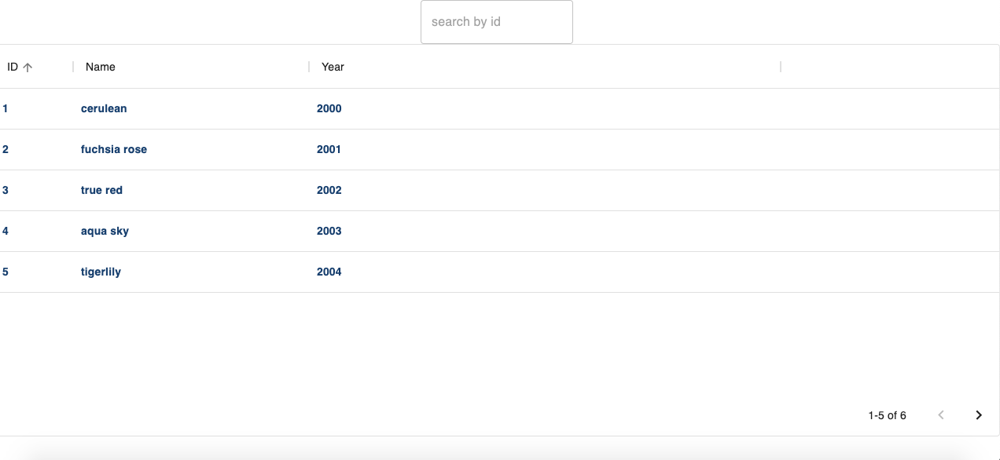

Product list SPA app

!!! In progress - but take a peek, it looks not bad already !!!

Te main purpose of the project is creacting an SPA application with just one view.

The application should use API endpoint to display the paginated list of products.

## Table of Contents

* [General Info](#general-information)
* [Technologies Used](#technologies-used)
* [Screenshots](#screenshots)
* [Setup](#setup)
* [Project Status](#project-status)
* [Room for Improvement](#room-for-improvement)
* [Contact](#contact)

## General Information

- At the top of the view, there should be text input, which allows the user to filter results by id.
- Below this input user should see a table displaying the following items’ properties: id, name, and year.
- Additionally, the background color of each row should be taken from the color property.
-  The table should display 5 items per page. Under the table, there should be a pagination component, which allows switching between pages with “next” and “previous” arrows.
## Technologies Used

- React
- Data-grid
- Material UI
- React Hooks (useState, useEffect)

## Screenshots

## Setup

- download or clone repository / `git clone repo_address`
- install dependencies / `npm install`
- start app by `npm start`

## Project Status

Project is: _in progress_.

[//]: # (Assumed learning task completed.)

## Room for Improvement

- Text input for now don't allow user to filter by id, but it should be possible to do it in the future. For now user can search by id with use of data-grid component.
- Background color of each row doesn't take color properties from the API, but it should be possible to do it in the future.

## Contact

Created by [_Duckjaniels_](https://www.linkedin.com/in/maksym-kaczorowski-008b3a154/) - feel free to contact me!